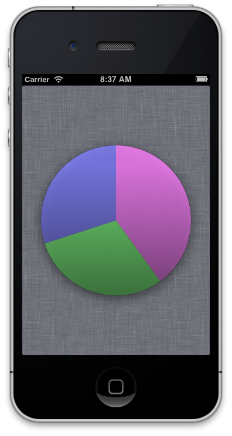

# chartreuse [/ʃɑrˈtrus/](http://www.merriam-webster.com/dictionary/chartreuse) #
## Lightweight, stylish charts for iOS! ##

*NOTE: Currently only supports pie-charts, but requests are welcome!*

Contains source and a fully working universal app project.

(I'd also check out [core-plot](http://code.google.com/p/core-plot/) to make sure it *isn't* what you want, first; chartreuse is very light-weight.)



## Using is easy as pie... ##

Basically, grab the two main files (`PieChartView.[h|m]`) from `PieChartViewExample/Classes/` and add them to your project (or create a submodule or whatever). Then:

```objective-c
// Set a gradient to start 1/3 from the top, and continue to the bottom
[_pieChart setGradientFillStart:0.3 andEnd:1.0];
// Use black 0.7 opaque for our gradient
[_pieChart setGradientFillColor:PieChartItemColorMake(0.0, 0.0, 0.0, 0.7)];

// Create three data items to show in our pie chart
[_pieChart addItemValue:0.4 withColor:PieChartItemColorMake(1.0, 0.5, 1.0, 0.8)];
[_pieChart addItemValue:0.3 withColor:PieChartItemColorMake(0.5, 1.0, 0.5, 0.8)];
[_pieChart addItemValue:0.3 withColor:PieChartItemColorMake(0.5, 0.5, 1.0, 0.8)];

// If the piechart is hidden, show it
[_pieChart setHidden:NO];

// Force the drawRect: method to be called
[_pieChart setNeedsDisplay];
```

Or if you want to fade the pie chart in, you can do:

```objective-c
_pieChart.alpha = 0.0;
[_pieChart setHidden:NO];
[_pieChart setNeedsDisplay];

// Animate the fade-in
[UIView beginAnimations:nil context:NULL];
[UIView setAnimationDuration:0.5];
_pieChart.alpha = 1.0;
[UIView commitAnimations];
```
